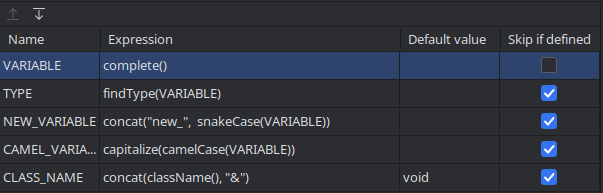

# Type Finder
This is a basic plugin that will parse the currently open file in order to find the type of a variable.
Created for use in live templates, specifically custom setters:
```bash
$CLASS_NAME$ set$CAMEL_VARIABLE$($TYPE$ $NEW_VARIABLE$){
    $VARIABLE$ = $NEW_VARIABLE$;
    return *this;
}
```
